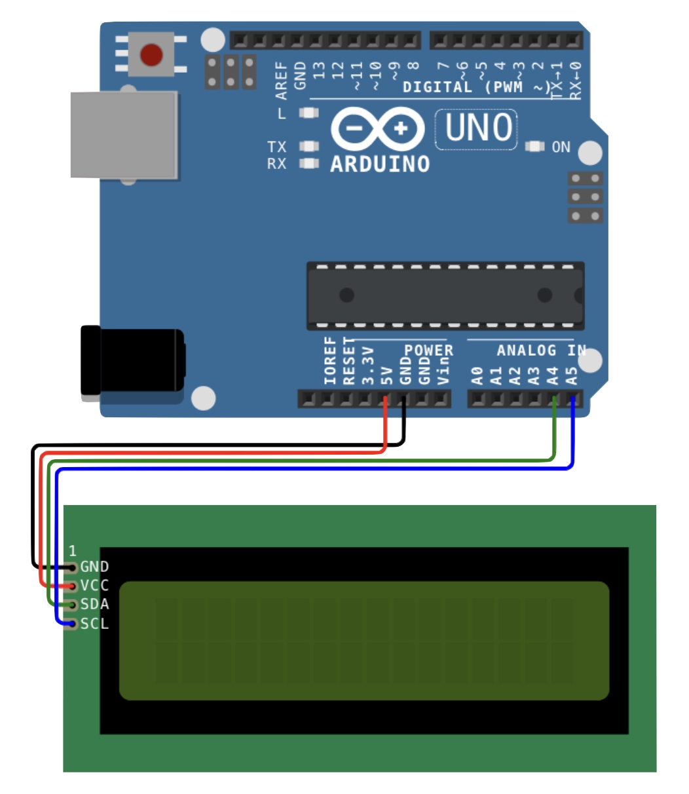

# Arduino-lcd-i2c
I2C display for Arduino

# Cíl
- Něco zobrazit na displeji
 (Něco = to co já chci)

# HW
- LCD na I2C
- čip: PCF8574T
- Arduino UNO R3

# SW
- Arduino IDE
- Knihovny
  - ??? PCF8574T ??? Nemá něco Adafruit?
  - https://www.mathertel.de/Arduino/LiquidCrystal_PCF8574
    - Tahle funguje
    - Od Matthiase Hertella

# SCHÉMA
